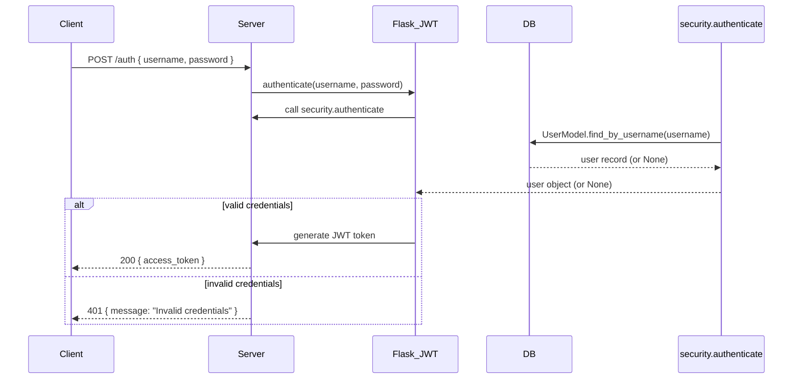

# API Reference – Authentication Endpoint (POST /auth)

Section Index  

- Overview
- Configuration &amp; Dependencies
- Endpoint Details
    - Request
    - Response
    - Error Responses
- Authentication Flow Diagram
- Usage in Protected Routes

---

## Overview

The <code>POST /auth</code> endpoint is provided by Flask-JWT’s built-in mechanism to authenticate users and issue JSON Web Tokens (JWTs). Clients exchange valid credentials for an <code>access_token</code>, which is then used to access protected resources throughout the API.

---

## Configuration &amp; Dependencies

| Component | Location | Responsibility |
| --- | --- | --- |
| Flask App &amp; JWT Setup | <code>app.py</code> | Registers <code>/auth</code>, sets <code>secret_key</code>, initializes JWT |
| Credential Verification | <code>security.py</code> | Defines <code>authenticate</code> and <code>identity</code> functions |
| User Model | <code>models/user.py</code> | Persists and queries user records |
| Password Safety | <code>werkzeug.security.safestrcmp</code> | Secure string comparison to prevent timing attacks |

Key Configuration in <code>app.py</code>:

```python
from flask import Flask
from flask_restful import Api
from flask_jwt import JWT
from security import authenticate, identity

app = Flask(__name__)
app.secret_key = 'SapanCrackle'                     # Used to sign JWT tokens
api = Api(app)

# Registers /auth, wired to security.authenticate & security.identity
jwt = JWT(app, authenticate, identity)              # /auth endpoint created here 
```

Credential Handlers in <code>security.py</code>:

```python
from werkzeug.security import safe_str_cmp
from models.user import UserModel

def authenticate(username, password):
    user = UserModel.find_by_username(username)
    if user and safe_str_cmp(user.password, password):
        return user

def identity(payload):
    user_id = payload['identity']
    return UserModel.find_by_id(user_id)
```

- <code>authenticate</code>: Verifies credentials against the database.
- <code>identity</code>: Retrieves user by ID embedded in JWT payload.

---

## Endpoint Details

```api
{
    "title": "Authenticate User",
    "description": "Exchange valid username and password for a JWT access token",
    "method": "POST",
    "baseUrl": "https://api.example.com",
    "endpoint": "/auth",
    "headers": [
        {
            "key": "Content-Type",
            "value": "application/json",
            "required": true
        }
    ],
    "queryParams": [],
    "pathParams": [],
    "bodyType": "json",
    "requestBody": "{\n  \"username\": \"sapan\",\n  \"password\": \"sapan1234\"\n}",
    "formData": [],
    "rawBody": "",
    "responses": {
        "200": {
            "description": "Authentication successful; returns access token",
            "body": "{\n  \"access_token\": \"<JWT Token>\"\n}"
        },
        "401": {
            "description": "Invalid credentials or missing fields",
            "body": "{\n  \"message\": \"Invalid credentials\"\n}"
        }
    }
}
```

### Request

| Field | Type | Required | Description |
| --- | --- | --- | --- |
| username | string | yes | Registered user’s name |
| password | string | yes | Corresponding password |

Example:

```json
{
  "username": "sapan",
  "password": "sapan1234"
}
```

### Successful Response (200)

| Field | Type | Description |
| --- | --- | --- |
| access_token | string | JWT used for protected routes |

Example:

```json
{
  "access_token": "eyJ0eXAiOiJKV1QiLCJh..."
}
```

### Error Responses

| Status | Body | Cause |
| --- | --- | --- |
| 401 | <code>{ "message": "Invalid credentials" }</code> | Wrong username or password |
| 400 | <code>{ "message": "Bad request" }</code> (default) | Missing JSON body or fields |

---

## Authentication Flow

Below is a high-level sequence diagram illustrating the steps taken when a client calls <code>POST /auth</code>:



---

## Usage in Protected Routes

Once an <code>access_token</code> is obtained:

1. Include it in the <code>Authorization</code> header of subsequent requests:

```plaintext
   Authorization: JWT <access_token>
```

1. Endpoints decorated with <code>@jwt_required()</code> (e.g., <code>GET /book/&lt;/code&gt;) will validate the token before granting access .</code>

By centralizing authentication via <code>POST /auth</code>, the API ensures a consistent and secure mechanism for user validation and token issuance.