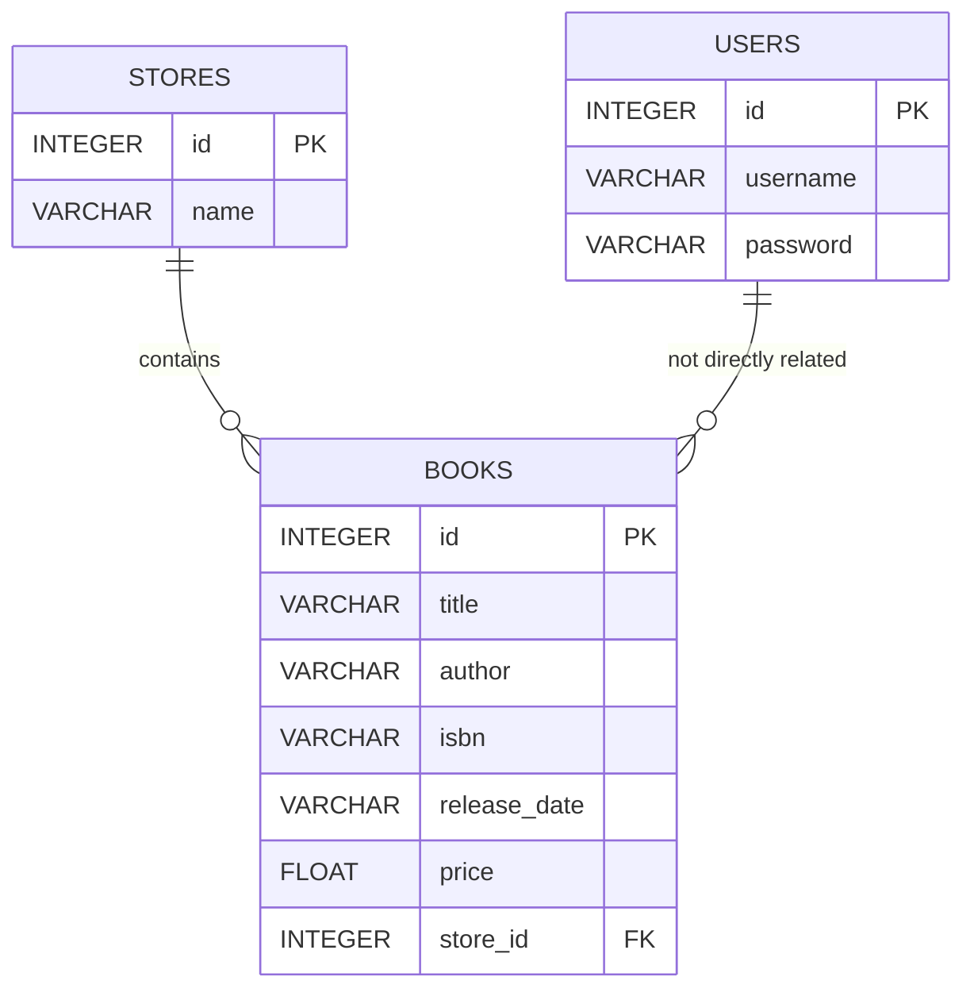

# Configuration

## Index
- [Database Configuration](#database-configuration)

---

## Database Configuration

This section details how the application configures and initializes its database layer using **Flask-SQLAlchemy** with **SQLite** as the storage engine. It covers:

- Purpose and overview  
- Connection string (`SQLALCHEMY_DATABASE_URI`)  
- Key SQLAlchemy settings  
- Initialization workflow (`db.init_app` & `db.create_all`)  
- Integration with models  
- Entity-Relationship diagram  

---

### 1. Overview

The demo RESTful API uses **SQLite** for simplicity and portability. All database interactions—defining tables, querying, and persisting data—are handled through **SQLAlchemy**, a powerful Object-Relational Mapper (ORM) exposed via the **Flask-SQLAlchemy** extension.

Key files involved:  
- **app.py**: Core Flask application and configuration   
- **db.py**: Exports the `db` instance of `SQLAlchemy`   
- **models/\***: Table schemas and relationships (BookModel, StoreModel, UserModel)   

---

### 2. Connection String

The primary setting to configure the database is:

```python
# app.py
app.config['SQLALCHEMY_DATABASE_URI'] = 'sqlite:///data.db'
```

- **sqlite:///data.db**  
  - Three slashes (`///`) instruct SQLAlchemy to use a relative path to `data.db` in the application’s root.
  - If the file does not exist at startup, SQLite creates it automatically. 

---

### 3. Core SQLAlchemy Settings

Beyond the URI, the application sets several important configuration keys:

| Configuration Key                    | Value          | Purpose                                                                 |
|--------------------------------------|----------------|-------------------------------------------------------------------------|
| **SQLALCHEMY_DATABASE_URI**          | sqlite:///data.db | Defines the database backend and file location.                      |
| **SQLALCHEMY_TRACK_MODIFICATIONS**   | True           | Enables tracking of object modifications. Can incur overhead if enabled. |
| **PROPAGATE_EXCEPTIONS**             | True           | Ensures all exceptions bubble up to Flask’s error handlers.             |
| **SECRET_KEY**                       | SapanCrackle   | Used by Flask-JWT to sign authentication tokens.                        |

```python
# app.py
app.config['SQLALCHEMY_TRACK_MODIFICATIONS'] = True
app.config['PROPAGATE_EXCEPTIONS'] = True
app.secret_key = 'SapanCrackle'
```  


---

### 4. Database Initialization Workflow

1. **Instantiate the `db` object**  
   The application creates a single `SQLAlchemy` instance in `db.py`:

   ```python
   # db.py
   from flask_sqlalchemy import SQLAlchemy

   db = SQLAlchemy()
   ```  
   

2. **Initialize with the Flask App**  
   Under the `__main__` guard, the app binds `db` to the Flask context:

   ```python
   # app.py
   if __name__ == '__main__':
       from db import db
       db.init_app(app)
       app.run(port=5000, debug=True)
   ```  
   - `db.init_app(app)` attaches the application’s configuration to the `db` object. 

3. **Automatic Table Creation**  
   Before handling the first HTTP request, the app ensures all tables defined by models are created:

   ```python
   # app.py
   @app.before_first_request
   def create_tables():
       db.create_all()
   ```  
   - `db.create_all()` reads all subclasses of `db.Model` (e.g., `BookModel`, `StoreModel`, `UserModel`) and creates the corresponding tables if they don’t already exist. 

---

### 5. Model Integration

Every model imports the same `db` object to define its schema:

```python
# models/book.py
from db import db

class BookModel(db.Model):
    __tablename__ = 'books'

    id           = db.Column(db.Integer, primary_key=True)
    title        = db.Column(db.String(80))
    author       = db.Column(db.String(80))
    isbn         = db.Column(db.String(40))
    release_date = db.Column(db.String(10))
    price        = db.Column(db.Float(precision=2))
    store_id     = db.Column(db.Integer, db.ForeignKey('stores.id'))

    store        = db.relationship('StoreModel')
    ...
```

- **Foreign Keys & Relationships**  
  - `store_id` references `stores.id`.  
  - `store = db.relationship('StoreModel')` enables ORM-level navigation from a book to its store.   

Similar patterns exist in `StoreModel` and `UserModel`. All models share the same `db.session` for transactions.

---

### 6. Database Schema Diagram

Below is an **Entity-Relationship Diagram** illustrating the three core tables and their relationships.



- **USERS**  
  - Stores application users for authentication.  
- **STORES**  
  - Parent entity for **BOOKS**; a one-to-many relationship.  
- **BOOKS**  
  - Each book optionally belongs to a store via `store_id`.  

---

### 7. Summary

- **SQLite** offers a zero-configuration, file-based database—perfect for demos and local development.  
- **Flask-SQLAlchemy** abstracts common database operations and integrates seamlessly with Flask’s app configuration.  
- **Automatic table creation** ensures the database schema is ready at runtime without manual migrations.  
- **Models** define schemas and relationships, all backed by the same `db` session and engine.  

This configuration section forms the backbone of data persistence in the API, enabling secure authentication via users, management of stores, and CRUD operations on books.