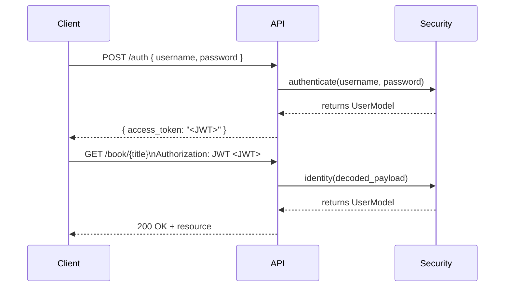

# Configuration – JWT Settings

An essential aspect of securing our RESTful API is configuring JSON Web Token (JWT) authentication. This section dives deep into how JWT is set up in magarrent/REST-API-PYTHON-demo, covering:

---

## 1. Secret Key

<code>app.secret_key</code> defines the secret used to sign all JWT tokens (and Flask sessions). Keeping this value confidential is critical—exposure compromises the integrity of issued tokens.

```python
# PYTHON/app.py
app = Flask(__name__)
# … other config …
app.secret_key = 'SapanCrackle'
```

- Location: <code>PYTHON/app.py</code>
- Purpose:
    - Cryptographically sign JWTs (HMAC-SHA256 by default).
    - Secure Flask session cookies if used.

---

## 2. JWT Initialization

The <code>flask_jwt</code> extension wires up authentication via a single line:

```python
# Mounts /auth endpoint using the 'authenticate' and 'identity' handlers
jwt = JWT(app, authenticate, identity)  # /auth
```

- Location: <code>PYTHON/app.py</code>
- What It Does:
    - Registers a POST <code>/auth</code> route.
    - Expects JSON <code>{ "username": ..., "password": ... }</code>.
    - Calls <code>authenticate(username, password)</code> to verify credentials.
    - Issues a signed JWT in response (<code>access_token</code>).
    - Hooks <code>identity(payload)</code> to protect subsequent requests.

---

## 3. Authentication Endpoint

All JWT-related requests occur against the automatically mounted <code>/auth</code> endpoint.

```api
{
    "title": "Obtain JWT Access Token",
    "description": "Exchange valid credentials for a signed JWT.",
    "method": "POST",
    "baseUrl": "http://localhost:5000",
    "endpoint": "/auth",
    "headers": [
        {
            "key": "Content-Type",
            "value": "application/json",
            "required": true
        }
    ],
    "queryParams": [],
    "pathParams": [],
    "bodyType": "json",
    "requestBody": "{\n  \"username\": \"sapan\",\n  \"password\": \"sapan1234\"\n}",
    "formData": [],
    "rawBody": "",
    "responses": {
        "200": {
            "description": "Token issued successfully",
            "body": "{\n  \"access_token\": \"<jwt_token>\"\n}"
        },
        "401": {
            "description": "Invalid credentials",
            "body": "{\n  \"message\": \"Invalid credentials\"\n}"
        }
    }
}
```

---

## 4. Security Functions

Two application-specific handlers drive JWT operations:

| Function | Location | Responsibility |
| --- | --- | --- |
| <code>authenticate</code> | <code>PYTHON/security.py</code> | Verify username/password; return <code>UserModel</code> on success. |
| <code>identity</code> | <code>PYTHON/security.py</code> | Extract user identity from JWT payload; return <code>UserModel</code>. |

```python
# PYTHON/security.py
from werkzeug.security import safe_str_cmp
from models.user import UserModel

def authenticate(username, password):
    user = UserModel.find_by_username(username)
    if user and safe_str_cmp(user.password, password):
        return user

def identity(payload):
    user_id = payload['identity']
    return UserModel.find_by_id(user_id)
```

- Credential Check: uses <code>safestrcmp</code> for timing-attack-resistant password comparison.
- Identity Lookup: reads the <code>identity</code> claim from token payload.

---

## 5. Authentication Workflow

Below is a high-level sequence diagram illustrating the JWT flow from login to resource access.



---

## 6. Customization &amp; Advanced Settings

While this demo uses default JWT behavior, <code>flask_jwt</code> allows fine-tuning via Flask configuration keys:

| Config Key | Default | Description |
| --- | --- | --- |
| <code>JWTAUTHURL_RULE</code> | <code>'/auth'</code> | URL rule for auth endpoint |
| <code>JWTAUTHUSERNAME_KEY</code> | <code>'username'</code> | JSON key for username in auth request |
| <code>JWTAUTHPASSWORD_KEY</code> | <code>'password'</code> | JSON key for password in auth request |
| <code>JWTAUTHHEADER_PREFIX</code> | <code>'JWT'</code> | Prefix for Authorization header |
| <code>JWTEXPIRATIONDELTA</code> | 300 seconds | Token lifetime |
| <code>JWTHEADERNAME</code> | <code>'Authorization'</code> | Header name to read token from |

To override, simply set in your Flask app before <code>(JWT(...))</code>:

```python
app.config['JWT_AUTH_URL_RULE']      = '/login'
app.config['JWT_EXPIRATION_DELTA']   = timedelta(hours=1)
app.config['JWT_AUTH_HEADER_PREFIX'] = 'Bearer'
```

---

Summary:  

- <code>app.secret_key</code>: anchors JWT signing
- <code>JWT(app, authenticate, identity)</code>: auto-mounts <code>/auth</code>
- <code>authenticate</code> / <code>identity</code>: secure credential and payload handling.
- Optional configs exist for customizing URL rules, expiration, and header formats.