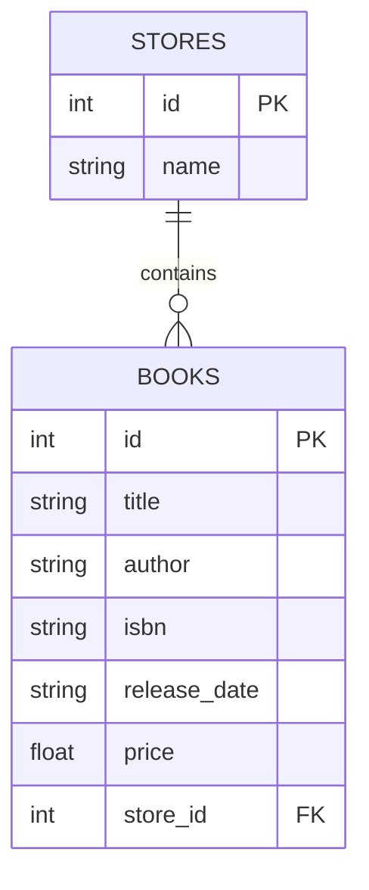

# Data Models

## Index

1. [Overview](#overview)  
2. [Table Definition & Attributes](#table-definition--attributes)  
3. [Relationships](#relationships)  
4. [Constructor](#constructor)  
5. [Serialization Method](#serialization-method)  
6. [CRUD Helper Methods](#crud-helper-methods)  
7. [Usage in the REST API](#usage-in-the-rest-api)  
8. [Entity Relationship Diagram](#entity-relationship-diagram)  

---

## Overview

The BookModel class encapsulates the persistence logic for the `books` table in the SQLite database. It uses SQLAlchemy’s ORM to map Python objects to database rows, providing:

- A clear schema definition for each column.  
- Helper methods to serialize instances to JSON.  
- Class and instance methods for CRUD operations.  

As part of the broader application, BookModel interacts with the `StoreModel` (to which it belongs) and is consumed by the book-related API resources. 

---

## Table Definition & Attributes

Defined in `models/book.py`, BookModel extends `db.Model` and declares its table name and columns:

```python
from db import db

class BookModel(db.Model):
    __tablename__ = 'books'

    id            = db.Column(db.Integer, primary_key=True)
    title         = db.Column(db.String(80))
    author        = db.Column(db.String(80))
    isbn          = db.Column(db.String(40))
    release_date  = db.Column(db.String(10))
    price         = db.Column(db.Float(precision=2))
    store_id      = db.Column(db.Integer, db.ForeignKey('stores.id'))
    store         = db.relationship('StoreModel')
```

| Attribute | Type | Description |
| --- | --- | --- |
| id | Integer (PK) | Unique primary key for each book. |
| title | String(80) | Book title (unique constraint enforced at API level). |
| author | String(80) | Name of the author. |
| isbn | String(40) | International Standard Book Number. |
| release_date | String(10) | Publication date (e.g., "YYYY-MM-DD"). |
| price | Float(precision=2) | Retail price with two decimal places. |
| store_id | Integer (FK) | References the owning store’s `id` in the `stores` table. |


---

## Relationships

- `store_id` (ForeignKey): Links each book to a StoreModel record.  
- `store` (relationship): Provides an ORM-level back-reference to the `StoreModel` instance.  

This relationship allows eager or lazy loading of store data alongside its books.  

---

## Constructor

```python
def __init__(self, title, price, store_id, author, isbn, release_date):
    self.title        = title
    self.price        = price
    self.store_id     = store_id
    self.author       = author
    self.isbn         = isbn
    self.release_date = release_date
```

- Parameters  - `title` (str)  
- `price` (float)  
- `store_id` (int)  
- `author` (str)  
- `isbn` (str)  
- `release_date` (str)  

Ensures that all necessary fields are set on creation. 

---

## Serialization Method

```python
def json(self):
    return {
        'title'       : self.title,
        'price'       : self.price,
        'author'      : self.author,
        'isbn'        : self.isbn,
        'release_date': self.release_date
    }
```

- Converts a BookModel instance into a JSON-serializable dictionary, omitting internal IDs and foreign keys for cleaner API responses. 

---

## CRUD Helper Methods

| Method | Description |
| --- | --- |
| findbytitle(cls, title) | Class method; returns the first book matching `title`, or `None` if not found. |
| savetodb(self) | Adds or updates the current instance in the database. Commits the session. |
| deletefromdb(self) | Removes the current instance from the database. Commits the session. |


These abstractions centralize data access logic, keeping API resources concise.

---

## Usage in the REST API

Within `resources/book.py`, BookModel powers the Book and BookList endpoints:

```python
from models.book import BookModel

class Book(Resource):
    @jwt_required()
    def get(self, title):
        book = BookModel.find_by_title(title)
        if book:
            return book.json()
        return {'message': 'book not found'}, 404
    # ... post, delete, put use save_to_db(), delete_from_db(), json()
```

- GET /book/</strong>: Fetches a single book by title.  
- POST /book/</strong>: Creates a new book if none exists.  
- PUT /book/</strong>: Updates an existing book’s price or creates a new one.  
- DELETE /book/</strong>: Deletes the specified book.  
- GET /books (BookList): Lists all books, serializing via `json()`.

This tight integration ensures that all API operations delegate persistence to the BookModel. 

---

## Entity Relationship Diagram

Below is an ER diagram illustrating the relationship between stores and books:



Figure: Relationship between `stores` (one) and `books` (many).  

This diagram clarifies how each book record is linked to a store, enforcing referential integrity at the database level.  

---

End of BookModel Documentation