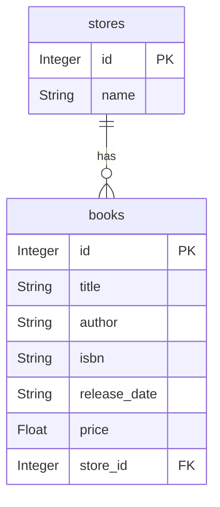

# Data Models – StoreModel

**Location:** `PYTHON/models/store.py` 

---

## Index

1. [Overview](#overview)  
2. [Table Schema](#table-schema)  
3. [Class Definition & Attributes](#class-definition--attributes)  
4. [Relationships](#relationships)  
5. [CRUD & Utility Methods](#crud--utility-methods)  
6. [Integration with Resources](#integration-with-resources)  
7. [Entity–Relationship Diagram](#entity–relationship-diagram)  

---

## Overview

The **StoreModel** class is an SQLAlchemy ORM model that represents the `stores` table in the database. It encapsulates:

- The **schema** definition for a store (its columns and primary key).  
- A **one-to-many** relationship with books.  
- **JSON serialization** for API responses.  
- **CRUD** (Create, Read, Update, Delete) methods to interact with the database session.  

This model follows the **Active Record** pattern, where each instance carries both data and behavior to persist itself.

---

## Table Schema

| Column Name | Type           | Constraints                  | Description                         |
|-------------|----------------|------------------------------|-------------------------------------|
| `id`        | Integer        | Primary Key, Auto-increment  | Unique identifier for the store.    |
| `name`      | String(80)     | (none)                       | Human-readable name of the store.   |

---

## Class Definition & Attributes

```python
from db import db

class StoreModel(db.Model):
    __tablename__ = 'stores'                         # Table name in the DB
    id        = db.Column(db.Integer, primary_key=True)
    name      = db.Column(db.String(80))
    books     = db.relationship('BookModel',
                                lazy='dynamic')
```

- **`__tablename__`**  
  Sets the underlying table name to `stores`.

- **`id`**  
  Auto-incrementing primary key.

- **`name`**  
  The name of the store (up to 80 characters).

- **`books`**  
  A dynamic relationship to the `BookModel` class. See [Relationships](#relationships) for details.

---

## Relationships

- **One Store → Many Books**  
  - **Parent model:** `StoreModel`  
  - **Child model:** `BookModel`  
  - **ForeignKey** on `BookModel.store_id` pointing to `stores.id`.  
  - **Lazy loading (`lazy='dynamic'`):**  
    Returns a query object (`self.books`) instead of a list, allowing further filtering and efficient data access.

> **BookModel snippet (for context):**  
> ```python
> store_id = db.Column(db.Integer, db.ForeignKey('stores.id'))
> store    = db.relationship('StoreModel')
> ```  
> – see BookModel in `PYTHON/models/book.py` 

---

## CRUD & Utility Methods

| Method                  | Signature                                 | Description                                                                                                      |
|-------------------------|-------------------------------------------|------------------------------------------------------------------------------------------------------------------|
| **Constructor**         | `__init__(self, name)`                    | Initializes a new store instance with the given `name`.                                                          |
| **Serialize to JSON**   | `json(self) -> dict`                      | Returns a JSON-friendly dict: the store’s name plus a list of all associated books (via `book.json()`).         |
| **Find by Name**        | `@classmethod find_by_name(cls, name)`    | Retrieves the first store matching `name` or `None` if not found.                                                |
| **Save to Database**    | `save_to_db(self)`                        | Adds (or updates) this instance to the session and commits, persisting changes.                                  |
| **Delete from Database**| `delete_from_db(self)`                    | Deletes this instance from the session and commits, removing it permanently.                                     |

```python
def __init__(self, name):
    self.name = name

def json(self):
    return {
        'name':  self.name,
        'books': [book.json() for book in self.books.all()]
    }

@classmethod
def find_by_name(cls, name):
    return cls.query.filter_by(name=name).first()

def save_to_db(self):
    db.session.add(self)
    db.session.commit()

def delete_from_db(self):
    db.session.delete(self)
    db.session.commit()
```

---

## Integration with Resources

The `StoreModel` is consumed by the **Store** and **StoreList** resources in `PYTHON/resources/store.py`:

- **`GET /store/<name>`**  
  Retrieves a store by name, returning its `json()` payload or a 404 if not found.

- **`POST /store/<name>`**  
  Creates a new store; enforces uniqueness via `find_by_name` and handles DB errors.

- **`DELETE /store/<name>`**  
  Deletes the specified store, if it exists.

- **`GET /stores`**  
  Lists all stores by invoking `StoreModel.query.all()` and returning a list of `json()` results.

These endpoints leverage the model’s methods to perform persistence operations and serialization.  

---

## Entity–Relationship Diagram



- **PK** = Primary Key  
- **FK** = Foreign Key  

This diagram highlights the one-to-many relationship: **one** `stores` record can be associated with **multiple** `books` records.

---

**StoreModel** centralizes data access patterns for store-related operations, ensuring consistency and separation of concerns between the API layer (resources) and the database layer (models).