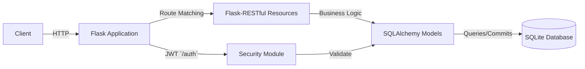

# Overview

This REST-API-PYTHON-demo repository provides a minimal yet feature-complete demonstration of a RESTful API built with Python’s Flask ecosystem. It enables clients to register users, authenticate via JWT, and manage books and stores, persisting data in an SQLite database through SQLAlchemy.

---

## Table of Contents

1. [Project Purpose](#project-purpose)  
2. [Tech Stack](#tech-stack)  
3. [High-Level Architecture](#high-level-architecture)  
4. [Project Structure](#project-structure)  
5. [Key Components](#key-components)  

---

## Project Purpose

This demo API illustrates how to:

- Expose CRUD operations for domain entities (`Book` and `Store`).  
- Secure sensitive routes with JWT-based authentication.  
- Structure a Flask application using Flask-RESTful for resource routing.  
- Integrate SQLAlchemy for ORM and database migrations.  
- Implement user registration and login flows.

All endpoints are intentionally simple, making this repository ideal for learning or bootstrapping similar Flask-based services.

---

## Tech Stack

| Technology | Purpose |
| --- | --- |
| Python 3.x | Programming language |
| Flask | Core web framework |
| Flask-RESTful | Resource-oriented routing and request parsing |
| Flask-JWT | JWT-based authentication middleware |
| SQLAlchemy | ORM for defining models and database interactions |
| SQLite | Lightweight file-based relational database |
| Werkzeug | Utility functions (`safestrcmp`) for secure password checks |


---

## High-Level Architecture



- Client sends HTTP requests to the API endpoints.  
- Flask Application (`app.py`) initializes the app, extensions, and routes .  
- Flask-RESTful Resources process requests, parse inputs, enforce authentication (`@jwt_required()`) and delegate to models .  
- SQLAlchemy Models encapsulate persistence logic for `UserModel`, `BookModel`, and `StoreModel` .  
- Security Module (`security.py`) defines `authenticate` and `identity` callbacks for JWT .  

---

## Project Structure

```plaintext
PYTHON/
├── app.py              # Application factory & route registration
├── db.py               # SQLAlchemy DB instance
├── security.py         # JWT auth handlers
├── models/
│   ├── book.py         # BookModel definition
│   ├── store.py        # StoreModel definition
│   └── user.py         # UserModel definition
└── resources/
    ├── book.py         # Book & BookList resources
    ├── store.py        # Store & StoreList resources
    └── user.py         # User registration resource
```

---

## Key Components

### 1. app.py

- Initializes the Flask app, configures SQLAlchemy and JWT.  
- Registers resource endpoints:- `POST   /auth`       – returns access token  
- `POST   /register`   – user signup  
- `GET/POST/PUT/...`   – `Book` and `Store` operations .  

```python
app = Flask(__name__)
app.config['SQLALCHEMY_DATABASE_URI'] = 'sqlite:///data.db'
app.secret_key = 'SapanCrackle'
api = Api(app)

jwt = JWT(app, authenticate, identity)  # /auth
api.add_resource(UserRegister, '/register')
api.add_resource(Book, '/book/<string:title>')
api.add_resource(BookList, '/books')
api.add_resource(Store, '/store/<string:name>')
api.add_resource(StoreList, '/stores')
```

### 2. db.py

Defines the shared `SQLAlchemy()` instance for model modules to import and initialize .

```python
from flask_sqlalchemy import SQLAlchemy
db = SQLAlchemy()
```

### 3. security.py

Implements JWT callbacks:

- `authenticate(username, password)`: Validates credentials using `UserModel.findbyusername` and `safestrcmp`.  
- `identity(payload)`: Retrieves user by `payload['identity']` .

```python
from werkzeug.security import safe_str_cmp
from models.user import UserModel

def authenticate(username, password):
    user = UserModel.find_by_username(username)
    if user and safe_str_cmp(user.password, password):
        return user

def identity(payload):
    user_id = payload['identity']
    return UserModel.find_by_id(user_id)
```

### 4. Models

- `UserModel` (`models/user.py`):- Table: `users`  
- Fields: `id`, `username`, `password`  
- Methods: `findbyusername`, `findbyid`, `savetodb` .
- `BookModel` (`models/book.py`):- Table: `books`, with fields for title, author, ISBN, release date, price, and `store_id` foreign key.  
- JSON serialization via `.json()`, and common CRUD methods (`savetodb`, `findbytitle`) .
- `StoreModel` (`models/store.py`):- Table: `stores`, one-to-many relationship to `BookModel`.  
- Includes `.json()` that nests all related books .

### 5. Resources

Each resource class subclasses `flask_restful.Resource`:

- UserRegister (`resources/user.py`): Handles `POST /register` to create new users.  
- Book & BookList (`resources/book.py`):  - `GET /book/` (protected), `POST`, `PUT`, `DELETE` for individual books.  </code>
- `GET /books` for listing all books.  
- Store & StoreList (`resources/store.py`):  - `GET /store/`, `POST`, `DELETE` for individual stores.  
- `GET /stores` for listing all stores.

These resources parse inputs via `reqparse`, enforce validation, and coordinate with models for persistence .

---

This Overview equips you with a clear understanding of how components fit together, the responsibilities of each module, and how data flows from HTTP requests through authentication, routing, business logic, and persistence.