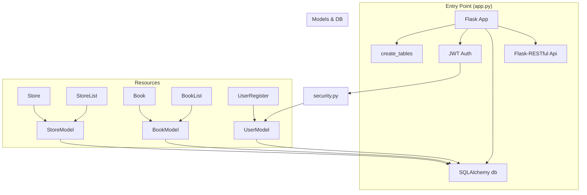

# Project Structure – Entry Point (app.py)

Welcome to the Entry Point documentation for the demo RESTful API built with Python’s Flask framework. This section dives into <code>app.py</code>, which bootstraps the entire application: initializing Flask, configuring extensions (SQLAlchemy, JWT), setting up the database, and registering all API resources.  

## Index

1. <a href="#overview">Overview</a>
1. <a href="#imports">Imports</a>
1. <a href="#application-configuration">Application Configuration</a>
1. <a href="#database-initialization">Database Initialization</a>
1. <a href="#jwt-authentication">JWT Authentication</a>
1. <a href="#resource-routing">Resource Routing</a>
1. <a href="#running-the-application">Running the Application</a>
1. <a href="#architecture-overview">Architecture Overview</a>
1. <a href="#api-endpoints">API Endpoints</a>

---

## Overview

The <code>app.py</code> file serves as the entry point of the application. It:

- Creates the Flask application instance
- Configures database and exception handling
- Hooks into Flask’s startup lifecycle to create tables
- Initializes JWT-based authentication
- Registers RESTful resources (routes)
- Launches the development server

```python
# PYTHON/app.py (excerpt)
app = Flask(__name__)
app.config['SQLALCHEMY_DATABASE_URI'] = 'sqlite:///data.db'
app.config['SQLALCHEMY_TRACK_MODIFICATIONS'] = True
app.config['PROPAGATE_EXCEPTIONS'] = True
app.secret_key = 'SapanCrackle'
api = Api(app)

@app.before_first_request
def create_tables():
    db.create_all()

jwt = JWT(app, authenticate, identity)  # /auth

# Resource registrations…
if __name__ == '__main__':
    from db import db
    db.init_app(app)
    app.run(port=5000, debug=True)
```

---

## Imports

| Module / Object | Purpose |
| --- | --- |
| <code>Flask</code> | Core Flask application factory |
| <code>Api</code> | Flask-RESTful wrapper for routing |
| <code>JWT</code> | Flask-JWT extension for token-based authentication |
| <code>authenticate, identity</code> | Security handlers mapping credentials → user &amp; token payload → user (<code>security.py</code>) |
| <code>UserRegister</code> | Resource for user sign-up (<code>resources/user.py</code>) |
| <code>Book</code>, <code>BookList</code> | CRUD resources for individual books &amp; book collections (<code>resources/book.py</code>) |
| <code>Store</code>, <code>StoreList</code> | CRUD resources for stores (<code>resources/store.py</code>) |

Imports in <code>app.py</code>:  

```python
from flask import Flask
from flask_restful import Api
from flask_jwt import JWT

from security import authenticate, identity
from resources.user import UserRegister
from resources.book import Book, BookList
from resources.store import Store, StoreList
```

---

## Application Configuration

After creating the Flask app, several configuration keys are set:

| Key | Value | Description |
| --- | --- | --- |
| <code>SQLALCHEMYDATABASEURI</code> | <code>sqlite:///data.db</code> | SQLite file database |
| <code>SQLALCHEMYTRACKMODIFICATIONS</code> | <code>True</code> | Enable event notifications (overhead in production) |
| <code>PROPAGATE_EXCEPTIONS</code> | <code>True</code> | Let exceptions propagate for unified error handling |
| <code>secret_key</code> | <code>'SapanCrackle'</code> | Cryptographic key for session &amp; JWT signature |

```python
app.config['SQLALCHEMY_DATABASE_URI'] = 'sqlite:///data.db'
app.config['SQLALCHEMY_TRACK_MODIFICATIONS'] = True
app.config['PROPAGATE_EXCEPTIONS'] = True
app.secret_key = 'SapanCrackle'
```

---

## Database Initialization

A SQLAlchemy instance is declared in <code>db.py</code> and bound to the Flask app on startup:

```python
# db.py
from flask_sqlalchemy import SQLAlchemy
db = SQLAlchemy()
```

In <code>app.py</code>, tables are auto-created before the first request:

```python
@app.before_first_request
def create_tables():
    db.create_all()
```

Then, within the <code>main</code> guard, SQLAlchemy is initialized:

```python
if __name__ == '__main__':
    from db import db
    db.init_app(app)
    app.run(port=5000, debug=True)
```

This ensures all models (User, Book, Store) generate their corresponding tables in <code>data.db</code> .

---

## JWT Authentication

Flask-JWT is initialized to provide a <code>/auth</code> endpoint:

```python
jwt = JWT(app, authenticate, identity)  # exposes /auth
```

- <code>authenticate(username, password)</code>: Validates credentials against stored users.
- <code>identity(payload)</code>: Loads a user by ID embedded in a valid token.

These functions reside in <code>security.py</code> and interact with <code>UserModel</code> .

---

## Resource Routing

All REST resources are registered on the Flask-RESTful <code>Api</code> instance:

```python
api.add_resource(Store, '/store/<string:name>')
api.add_resource(StoreList, '/stores')

api.add_resource(Book, '/book/<string:title>')
api.add_resource(BookList, '/books')

api.add_resource(UserRegister, '/register')
```

This maps:

- <code>Store</code> → <code>/store/</code>
- <code>StoreList</code> → <code>/stores</code>
- <code>Book</code> → <code>/book/&lt;/code&gt;  </code>
- <code>BookList</code> → <code>/books</code>
- <code>UserRegister</code> → <code>/register</code>

---

## Running the Application

Execute via:

```shell
python app.py
```

- Host: <code>localhost</code>
- Port: <code>5000</code>
- Debug Mode: Enabled for live reload &amp; detailed errors

---

## Architecture Overview



---

## API Endpoints

Below are interactive API blocks for each route defined in <code>app.py</code>. The baseUrl is <code>http://localhost:5000</code>.

```api
{
    "title": "Authenticate User",
    "description": "Obtain a JWT access token using valid credentials",
    "method": "POST",
    "baseUrl": "http://localhost:5000",
    "endpoint": "/auth",
    "headers": [
        {
            "key": "Content-Type",
            "value": "application/json",
            "required": true
        }
    ],
    "queryParams": [],
    "pathParams": [],
    "bodyType": "json",
    "requestBody": "{\n  \"username\": \"sapan\",\n  \"password\": \"sapan1234\"\n}",
    "formData": [],
    "rawBody": "",
    "responses": {
        "200": {
            "description": "Token returned",
            "body": "{\n  \"access_token\": \"<jwt_token>\"\n}"
        },
        "401": {
            "description": "Invalid credentials",
            "body": "{\n  \"message\": \"Invalid credentials\"\n}"
        }
    }
}
```

```api
{
    "title": "Register User",
    "description": "Create a new user account",
    "method": "POST",
    "baseUrl": "http://localhost:5000",
    "endpoint": "/register",
    "headers": [
        {
            "key": "Content-Type",
            "value": "application/json",
            "required": true
        }
    ],
    "queryParams": [],
    "pathParams": [],
    "bodyType": "json",
    "requestBody": "{\n  \"username\": \"sapan\",\n  \"password\": \"sapan1234\"\n}",
    "formData": [],
    "rawBody": "",
    "responses": {
        "201": {
            "description": "User created",
            "body": "{\n  \"message\": \"User created successfully.\"\n}"
        },
        "400": {
            "description": "Username already exists",
            "body": "{\n  \"message\": \"A user with that username already exists\"\n}"
        }
    }
}
```

```api
{
    "title": "Get Store",
    "description": "Retrieve details of a store by name",
    "method": "GET",
    "baseUrl": "http://localhost:5000",
    "endpoint": "/store/{name}",
    "headers": [],
    "queryParams": [],
    "pathParams": [
        {
            "key": "name",
            "value": "Name of the store",
            "required": true
        }
    ],
    "bodyType": "none",
    "requestBody": "",
    "formData": [],
    "rawBody": "",
    "responses": {
        "200": {
            "description": "Store found",
            "body": "{\n  \"name\": \"MyStore\",\n  \"books\": []\n}"
        },
        "404": {
            "description": "Store not found",
            "body": "{\n  \"message\": \"Store not found\"\n}"
        }
    }
}
```

```api
{
    "title": "Create Store",
    "description": "Create a new store",
    "method": "POST",
    "baseUrl": "http://localhost:5000",
    "endpoint": "/store/{name}",
    "headers": [],
    "queryParams": [],
    "pathParams": [
        {
            "key": "name",
            "value": "Name of the new store",
            "required": true
        }
    ],
    "bodyType": "none",
    "requestBody": "",
    "formData": [],
    "rawBody": "",
    "responses": {
        "201": {
            "description": "Store created",
            "body": "{\n  \"name\": \"NewStore\",\n  \"books\": []\n}"
        },
        "400": {
            "description": "Store already exists",
            "body": "{\n  \"message\": \"A store with name 'NewStore' already exists.\"\n}"
        },
        "500": {
            "description": "Server error",
            "body": "{\n  \"message\": \"An error occurred creating the store.\"\n}"
        }
    }
}
```

```api
{
    "title": "Delete Store",
    "description": "Delete an existing store",
    "method": "DELETE",
    "baseUrl": "http://localhost:5000",
    "endpoint": "/store/{name}",
    "headers": [],
    "queryParams": [],
    "pathParams": [
        {
            "key": "name",
            "value": "Name of the store to delete",
            "required": true
        }
    ],
    "bodyType": "none",
    "requestBody": "",
    "formData": [],
    "rawBody": "",
    "responses": {
        "200": {
            "description": "Store deleted",
            "body": "{\n  \"message\": \"Store deleted\"\n}"
        }
    }
}
```

```api
{
    "title": "List Stores",
    "description": "Retrieve a list of all stores",
    "method": "GET",
    "baseUrl": "http://localhost:5000",
    "endpoint": "/stores",
    "headers": [],
    "queryParams": [],
    "pathParams": [],
    "bodyType": "none",
    "requestBody": "",
    "formData": [],
    "rawBody": "",
    "responses": {
        "200": {
            "description": "List of stores",
            "body": "{\n  \"stores\": [ { \"name\": \"MyStore\", \"books\": [] } ]\n}"
        }
    }
}
```

```api
{
    "title": "Get Book",
    "description": "Retrieve a book by title (JWT required)",
    "method": "GET",
    "baseUrl": "http://localhost:5000",
    "endpoint": "/book/{title}",
    "headers": [
        {
            "key": "Authorization",
            "value": "JWT <token>",
            "required": true
        }
    ],
    "queryParams": [],
    "pathParams": [
        {
            "key": "title",
            "value": "Title of the book",
            "required": true
        }
    ],
    "bodyType": "none",
    "requestBody": "",
    "formData": [],
    "rawBody": "",
    "responses": {
        "200": {
            "description": "Book found",
            "body": "{\n  \"title\": \"MyBook\",\n  \"price\": 9.99,\n  \"author\": \"Jane Doe\",\n  \"isbn\": \"12345\",\n  \"release_date\": \"2021-01-01\"\n}"
        },
        "404": {
            "description": "Book not found",
            "body": "{\n  \"message\": \"book not found\"\n}"
        }
    }
}
```

```api
{
    "title": "Create Book",
    "description": "Add a new book by title",
    "method": "POST",
    "baseUrl": "http://localhost:5000",
    "endpoint": "/book/{title}",
    "headers": [],
    "queryParams": [],
    "pathParams": [
        {
            "key": "title",
            "value": "Title of the new book",
            "required": true
        }
    ],
    "bodyType": "json",
    "requestBody": "{\n  \"price\": 19.99,\n  \"store_id\": 1,\n  \"author\": \"Jane Doe\",\n  \"isbn\": \"67890\",\n  \"release_date\": \"2022-02-02\"\n}",
    "formData": [],
    "rawBody": "",
    "responses": {
        "201": {
            "description": "Book created",
            "body": "{\n  \"title\": \"MyBook\",\n  \"price\": 19.99,\n  \"author\": \"Jane Doe\",\n  \"isbn\": \"67890\",\n  \"release_date\": \"2022-02-02\"\n}"
        },
        "400": {
            "description": "Book already exists",
            "body": "{\n  \"message\": \"An book with title 'MyBook' already exists.\"\n}"
        },
        "500": {
            "description": "Server error",
            "body": "{\n  \"message\": \"An error occurred inserting the book.\"\n}"
        }
    }
}
```

```api
{
    "title": "Delete Book",
    "description": "Remove a book by title",
    "method": "DELETE",
    "baseUrl": "http://localhost:5000",
    "endpoint": "/book/{title}",
    "headers": [],
    "queryParams": [],
    "pathParams": [
        {
            "key": "title",
            "value": "Title of the book to delete",
            "required": true
        }
    ],
    "bodyType": "none",
    "requestBody": "",
    "formData": [],
    "rawBody": "",
    "responses": {
        "200": {
            "description": "Book deleted",
            "body": "{\n  \"message\": \"Item deleted.\"\n}"
        },
        "404": {
            "description": "Book not found",
            "body": "{\n  \"message\": \"Item not found.\"\n}"
        }
    }
}
```

```api
{
    "title": "Upsert Book",
    "description": "Update price or create a new book",
    "method": "PUT",
    "baseUrl": "http://localhost:5000",
    "endpoint": "/book/{title}",
    "headers": [],
    "queryParams": [],
    "pathParams": [
        {
            "key": "title",
            "value": "Title of the book",
            "required": true
        }
    ],
    "bodyType": "json",
    "requestBody": "{\n  \"price\": 25.00,\n  \"store_id\": 1,\n  \"author\": \"Jane Doe\",\n  \"isbn\": \"67890\",\n  \"release_date\": \"2022-02-02\"\n}",
    "formData": [],
    "rawBody": "",
    "responses": {
        "200": {
            "description": "Book updated or created",
            "body": "{\n  \"title\": \"MyBook\",\n  \"price\": 25.00,\n  \"author\": \"Jane Doe\",\n  \"isbn\": \"67890\",\n  \"release_date\": \"2022-02-02\"\n}"
        }
    }
}
```

```api
{
    "title": "List Books",
    "description": "Retrieve all books",
    "method": "GET",
    "baseUrl": "http://localhost:5000",
    "endpoint": "/books",
    "headers": [],
    "queryParams": [],
    "pathParams": [],
    "bodyType": "none",
    "requestBody": "",
    "formData": [],
    "rawBody": "",
    "responses": {
        "200": {
            "description": "Collection of books",
            "body": "{\n  \"books\": [\n    { \"title\": \"MyBook\", \"price\": 19.99, \"author\": \"Jane Doe\", \"isbn\": \"67890\", \"release_date\": \"2022-02-02\" }\n  ]\n}"
        }
    }
}
```

---

This comprehensive documentation covers how <code>app.py</code> orchestrates the application lifecycle, dependencies, and exposes the full suite of RESTful endpoints. It ties together the Flask core, SQLAlchemy ORM, Flask-JWT authentication, and all resource controllers in a coherent structure.