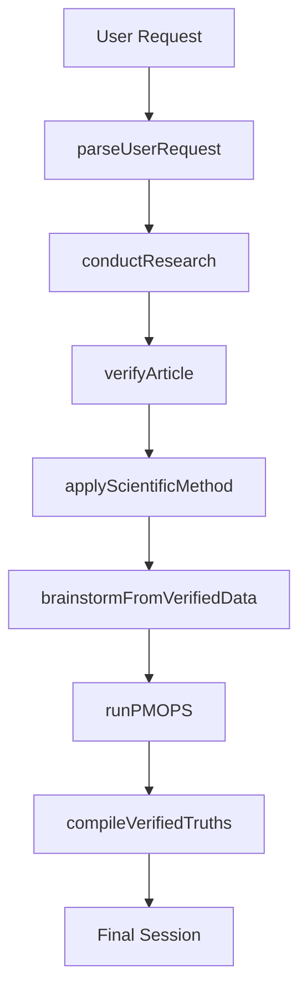
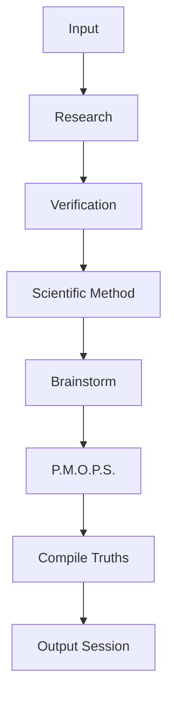

# Configuration Files

## next.config.mjs

This file configures Next.js build options and image handling.

- **TypeScript**: ignores build errors
- **Images**: disables built‐in optimization

```js
/** @type {import('next').NextConfig} */
const nextConfig = {
  typescript: { ignoreBuildErrors: true },
  images: { unoptimized: true },
}
export default nextConfig
```

## postcss.config.mjs

Defines PostCSS plugins for Tailwind CSS integration.

```js
/** @type {import('postcss-load-config').Config} */
const config = {
  plugins: {
    '@tailwindcss/postcss': {},
  },
}
export default config
```

## package.json

Specifies project metadata, scripts, and dependencies.

| Property | Description |
| --- | --- |
| name | Package name (“my-project”) |
| version | Version number (0.1.0) |
| private | Prevents accidental publish |


### Scripts

| Command | Runs |
| --- | --- |
| dev | next dev |
| build | next build |
| start | next start |
| lint | eslint . |


### Dependencies & DevDependencies

- **Frameworks & UI**: `next`, `react`, `tailwindcss`, `@radix-ui`, `lucide-react`
- **Form & Validation**: `react-hook-form`, `zod`
- **Analytics & Export**: `@vercel/analytics`, `vaul`
- **Dev Tools**: `typescript`, `postcss`, `autoprefixer`

---

# React Components

## theme-provider.tsx

Wraps `next-themes` provider to enable dark/light theme switching.

```tsx
'use client'
import { ThemeProvider as NextThemesProvider, type ThemeProviderProps } from 'next-themes'

export function ThemeProvider({ children, ...props }: ThemeProviderProps) {
  return <NextThemesProvider {...props}>{children}</NextThemesProvider>
}
```

## pipeline-progress.tsx

Visualizes pipeline stages with icons and progress state.

- **Props**:
- `currentStage: PipelineStage`
- `isRunning: boolean`
- **Behavior**:
- Marks stages as *complete*, *current*, or *pending*
- Renders connectors and animated pulse on current

```tsx
import { PipelineStage } from "@/lib/types"
import { Search, BookOpen, ShieldCheck, FlaskConical, Lightbulb, Users, Download } from "lucide-react"

const STAGES = [
  { key: PipelineStage.INPUT, label: "Input", icon: Search },
  { key: PipelineStage.RESEARCH, label: "Research", icon: BookOpen },
  { key: PipelineStage.VERIFICATION, label: "Verify", icon: ShieldCheck },
  { key: PipelineStage.SCIENTIFIC_METHOD, label: "Science", icon: FlaskConical },
  { key: PipelineStage.BRAINSTORMING, label: "Brainstorm", icon: Lightbulb },
  { key: PipelineStage.PMOPS, label: "P.M.O.P.S.", icon: Users },
  { key: PipelineStage.EXPORT, label: "Export", icon: Download },
]

// ... getStageIndex, PipelineProgress component ...
```

## stats-summary.tsx

Displays key metrics from a research session as cards.

- **Props**: `session: ResearchSession | null`
- **Stats**:
- Articles Analyzed
- Verified Truths
- Flagged Poisoned
- Avg. Credibility
- Ideas Generated
- Votes Cast

```tsx
import { Card, CardContent } from "@/components/ui/card"
import { BookOpen, CheckCircle2, ShieldAlert, FlaskConical, Lightbulb, Vote } from "lucide-react"

export function StatsSummary({ session }: { session: ResearchSession | null }) {
  if (!session) return null
  // compute values…
  return (
    <div className="grid …">
      {/* map over stats array */}
    </div>
  )
}
```

## research-dashboard.tsx

Orchestrates the entire UI: input, progress, error, agents, stats, and result panels in tabs.

- Manages `userRequest`, `session`, `exportText`, pipeline state, agent statuses, and errors
- Calls `/api/pipeline` on “Run Pipeline”
- Offers **Export** and **Reset** buttons
- Renders panels: Verification, Scientific, Brainstorm, P.M.O.P.S., Verified Truths, Code Audit, Export Preview

```tsx
import { useState, useCallback, useRef, useEffect } from "react"
import { Card, Button, Textarea, Tabs, Separator } from "@/components/ui"
import { PipelineProgress } from "@/components/pipeline-progress"
import { AgentCards } from "@/components/agent-cards"
import { VerificationPanel } from "@/components/verification-panel"
import { ScientificPanel } from "@/components/scientific-panel"
import { BrainstormPanel } from "@/components/brainstorm-panel"
import { PMOPSPanel } from "@/components/pmops-panel"
import { VerifiedTruthsPanel } from "@/components/verified-truths-panel"
import { CodeAuditPanel } from "@/components/code-audit-panel"
import { StatsSummary } from "@/components/stats-summary"
// … full component …
```

## agent-cards.tsx

Shows each agent’s name, status badge, description, current task, and skills.

- **Props**: `agents: Record<AgentRole, AgentDefinition>`
- Uses `AGENT_ICONS` lookup

```tsx
import { Card, CardHeader, CardTitle, CardContent } from "@/components/ui/card"
import { Badge } from "@/components/ui/badge"
import { AgentRole, AgentDefinition } from "@/lib/types"
// getStatusColor, getStatusLabel helpers
export function AgentCards({ agents }: { agents: Record<AgentRole, AgentDefinition> }) { /* … */ }
```

## verification-panel.tsx

Lists verification results per article.

- **Props**:
- `verifications: Verification[]`
- `articles: Article[]`
- Renders badge via `getStatusBadge`
- Shows credibility progress and individual checks
- Displays flagged issues if any

```tsx
import { Progress, ScrollArea, Badge, Card, CardHeader, CardContent, CardTitle } from "@/components/ui"
import { VerificationStatus } from "@/lib/types"
import { CheckCircle2, XCircle, AlertTriangle, Shield } from "lucide-react"
// getStatusBadge helper
export function VerificationPanel({ verifications, articles }: { verifications: Verification[], articles: Article[] }) { /* … */ }
```

## scientific-panel.tsx

Presents scientific validation for each article.

- **Props**:
- `validations: ScientificValidation[]`
- `articles: Article[]`
- Uses `ValidationRow` subcomponent for each check
- Shows overall verdict badge and extracted insights

```tsx
import { Badge, Progress, ScrollArea, Card, CardHeader, CardContent, CardTitle } from "@/components/ui"
import { Brain, Repeat2, Gauge, TrendingUp, Eye, ShieldAlert } from "lucide-react"
// getVerdictBadge, ValidationRow, ScientificPanel …
```

## brainstorm-panel.tsx

Displays generated ideas and novel procedures.

- **Props**: `results: BrainstormResult[]`
- Renders idea cards with feasibility & innovation progress bars
- Lists Novel Procedures, Method Extensions, Cross-Domain Applications

```tsx
import { Lightbulb, FlaskConical, ArrowRight, Globe } from "lucide-react"
import { Card, Badge, Progress, ScrollArea } from "@/components/ui"
// BrainstormPanel component …
```

## pmops-panel.tsx

Shows P.M.O.P.S. discussion:

- **Props**: `discussions: PMOPSDiscussion[]`
- Highlights **Winning Proposal**, **All Proposals**, **Voting Results**, and **Chat Log**
- Uses icons: `Trophy`, `Users`, `Vote`, `MessageSquare`

```tsx
import { Card, Badge, ScrollArea, Separator } from "@/components/ui"
import { Vote, MessageSquare, Trophy, Users } from "lucide-react"
// PMOPSPanel component …
```

## verified-truths-panel.tsx

Lists final verified truths.

- **Props**: `truths: VerifiedTruth[]`
- Shows title, content, credibility progress, methods, sources, and insights

```tsx
import { CheckCircle2, BookOpen, FlaskConical } from "lucide-react"
import { Card, Badge, Progress, ScrollArea } from "@/components/ui"
// VerifiedTruthsPanel …
```

## code-audit-panel.tsx

Presents code quality metrics and audited issues.

- **Props**: `session: ResearchSession`
- Computes metrics via `computeMetrics`
- Renders:
- **Code Quality Health** with score and key tiles
- **Code Audit Report** listing `AUDITED_ISSUES`
- **Pipeline Integrity Checks** (hardcoded passed checks)

```tsx
import { ShieldCheck, AlertTriangle, Bug, CheckCircle2, Activity, FileSearch } from "lucide-react"
import { AUDITED_ISSUES, generateQualityReport } from "@/lib/code-monitor"
import { Card, Badge, Progress, ScrollArea } from "@/components/ui"
// CodeAuditPanel component …
```

---

# Frontend Utilities & Library

## utils.ts

Utility `cn()` to merge Tailwind CSS classes safely.

```ts
import { clsx, type ClassValue } from 'clsx'
import { twMerge } from 'tailwind-merge'

export function cn(...inputs: ClassValue[]) {
  return twMerge(clsx(inputs))
}
```

## code-monitor.ts

Tracks pipeline events and generates a quality report.

- **Interfaces**: `MonitorEvent`, `QualityReport`, `PipelineMetrics`, `CodeIssue`
- **Constants**: `AUDITED_ISSUES` (list of resolved code issues)
- **Functions**:
- `createEventLog()`
- `recordEvent(log, type, message, stage?, data?)`
- `generateQualityReport(events, metrics)`

```ts
export interface MonitorEvent { /* … */ }
export const AUDITED_ISSUES: CodeIssue[] = [ /* … */ ]
export function createEventLog(): MonitorEvent[] { return [] }
export function recordEvent( log: MonitorEvent[], type: MonitorEvent["type"], message: string, stage?: string, data?: Record<string, unknown> ): MonitorEvent[] { /* … */ }
export function generateQualityReport(events: MonitorEvent[], metrics: PipelineMetrics): QualityReport { /* … */ }
```

## export.ts

Builds a structured export document and renders it as plain text.

- **Function**: `generateExportDocument(session): ExportDocument`
- **Section Builders**:
- `buildExecutiveSummary`
- `buildTruthSection`
- `buildMethodologySection`
- `buildVerificationSection`
- `buildScientificSection`
- `buildPMOPSSection`
- `buildRejectedDataSection`
- `buildAnalyticsSection`
- **Renderer**: `renderExportToText(doc): string`

```ts
export function generateExportDocument(session: ResearchSession): ExportDocument { /* … */ }
export function renderExportToText(doc: ExportDocument): string { /* … */ }
```

## types.ts (TS)

Defines core types for the frontend library.

- **Enums**: `PipelineStage`, `VerificationStatus`, `CredibilityLevel`, `AgentRole`
- **Interfaces**:
- `AgentDefinition`, `ResearchSession`, `Topic`, `Article`, `Citation`
- `Verification`, `VerificationCheck`
- `ScientificValidation`, `ValidationResult`
- `BrainstormResult`, `BrainstormIdea`
- `PMOPSDiscussion`, `PMOPSProposal`, `ChatMessage`, `VoteResult`
- `VerifiedTruth`
- `ExportDocument`, `ExportSection`
- `PipelineRequest`, `PipelineResponse`

```ts
export enum PipelineStage { INPUT = "input", /* … */ }
export interface ResearchSession { /* … */ }
export interface Verification { /* … */ }
// … other types …
```

## agents.ts

Defines AI agent metadata and system prompts.

- **Constants**:
- `AGENT_DEFINITIONS`: basic info per `AgentRole`
- `AGENT_SYSTEM_PROMPTS`: system‐level instructions
- **Function**: `createAgentTeam()` returns fresh idle copies

```ts
export const AGENT_DEFINITIONS: Record<AgentRole, AgentDefinition> = { /* … */ }
export const AGENT_SYSTEM_PROMPTS: Record<AgentRole, string> = { /* … */ }
export function createAgentTeam(): Record<AgentRole, AgentDefinition> { /* … */ }
```

## poison-shield.ts

Implements Data Poison Shield for verification.

- **Prompt**: `POISON_SHIELD_SYSTEM_PROMPT`
- **Interface**: `PoisonIndicator`
- **Patterns**: `POISON_INDICATORS` array of regex checks
- **Functions**:
- `scanForPoisonIndicators(text)` → matches
- `calculatePoisonRiskScore(indicators)` → risk 0-100

```ts
export const POISON_SHIELD_SYSTEM_PROMPT = `…`
export interface PoisonIndicator { pattern: RegExp; type: string; /* … */ }
export function scanForPoisonIndicators(text: string): { indicator: PoisonIndicator; match: string; position: number }[] { /* … */ }
export function calculatePoisonRiskScore(indicators: { indicator: PoisonIndicator }[]): number { /* … */ }
```

## pipeline.ts (TS)

Pure JS implementation of the research pipeline.

- **Helpers**: `generateId`, `now`
- **Metadata**: `SOURCE_META` for source labeling/snippets
- **Stage 1**: `parseUserRequest` → `Topic[]`
- **Stage 2**: `conductResearch` → `Article[]`
- **Stage 3**: `verifyArticle` → `Verification`
- **Stage 4**: `applyScientificMethod` → `ScientificValidation`
- **Stage 5**: `brainstormFromVerifiedData` → `BrainstormResult`
- **Stage 6**: `runPMOPS` → `PMOPSDiscussion`
- **Stage 7**: `compileVerifiedTruths` → `VerifiedTruth[]`
- **Orchestrator**: `runFullPipeline(userRequest)` → completes all stages

```ts
export function runFullPipeline(userRequest: string): ResearchSession { /* … */ }
```



---

# Python Library Modules

## __init__.py

Package entrypoint for `ai_research_verifier`.

- Sets `__version__`, `__author__`
- Exposes `run_pipeline` and `ResearchSession`

```py
__version__ = "1.0.0"
__author__ = "AI Research Verification Team"
from ai_research_verifier.pipeline import run_pipeline
from ai_research_verifier.types import ResearchSession
```

## types.py

Core type definitions via dataclasses and enums.

- **Enums**: `PipelineStage`, `VerificationStatus`, `CredibilityLevel`, `AgentRole`
- **Utilities**: `generate_id`, `now_iso`
- **Dataclasses**:
- `Citation`, `Topic`, `Article`
- `VerificationCheck`, `Verification`
- `ValidationResult`, `ScientificValidation`
- `BrainstormIdea`, `BrainstormResult`
- `ChatMessage`, `PMOPSProposal`, `VoteResult`, `PMOPSDiscussion`
- `VerifiedTruth`, `ResearchSession`

```py
@dataclass
class Article:
    id: str = field(default_factory=lambda: generate_id("article"))
    title: str = ""
    # … other fields …
```

## agents.py

Defines agent roles, display names, skills, system prompts, and PMOPS approaches.

- **Constants**:
- `AGENT_DISPLAY_NAMES`
- `AGENT_SKILLS`
- `AGENT_SYSTEM_PROMPTS`
- `AGENT_APPROACHES`

```py
AGENT_SYSTEM_PROMPTS = {
    AgentRole.RESEARCH_ANALYST: "You are the Research Analyst Agent…",
    # …
}
```

## poison_shield.py

Data Poison Shield logic for Python agents.

- **Prompt**: `POISON_SHIELD_SYSTEM_PROMPT`
- **Dataclass**: `PoisonIndicator`, `PoisonScanResult`
- **Constants**: `POISON_INDICATORS` (regex patterns)
- **Functions**:
- `scan_for_poison(text)`
- `calculate_poison_risk(results)`

```py
def scan_for_poison(text: str) -> list[PoisonScanResult]:
    # pure function, no side-effects
```

## export.py

Generates and saves `.txt` exports from a `ResearchSession`.

- **Function**: `export_to_text(session)`
- **File Writer**: `save_export(session, filepath)`

```py
def export_to_text(session: ResearchSession) -> str:
    # builds lines list, joins with "\n"
```

## pipeline.py

Orchestrates the multi-agent pipeline in Python.

- **Data**: `SOURCE_META`, `CHECK_RULES`
- **Stages**:
- `parse_user_request`
- `conduct_research`
- `verify_article`
- `apply_scientific_method`
- `brainstorm`
- `run_pmops`
- `compile_verified_truths`
- **Orchestrator**: `run_pipeline(user_request)`

```py
def run_pipeline(user_request: str) -> ResearchSession:
    # sequential, no loops or recursion
```



---

Each file implements a distinct part of the full **AI Research Verification System**, from configuration and UI on the frontend to multi-agent orchestration and export logic in both JavaScript/TypeScript and Python.